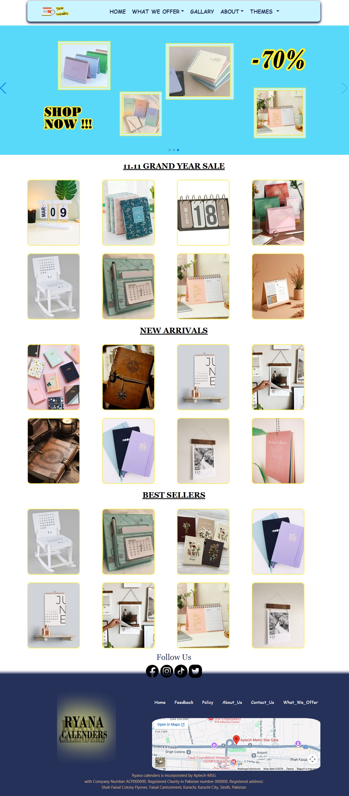
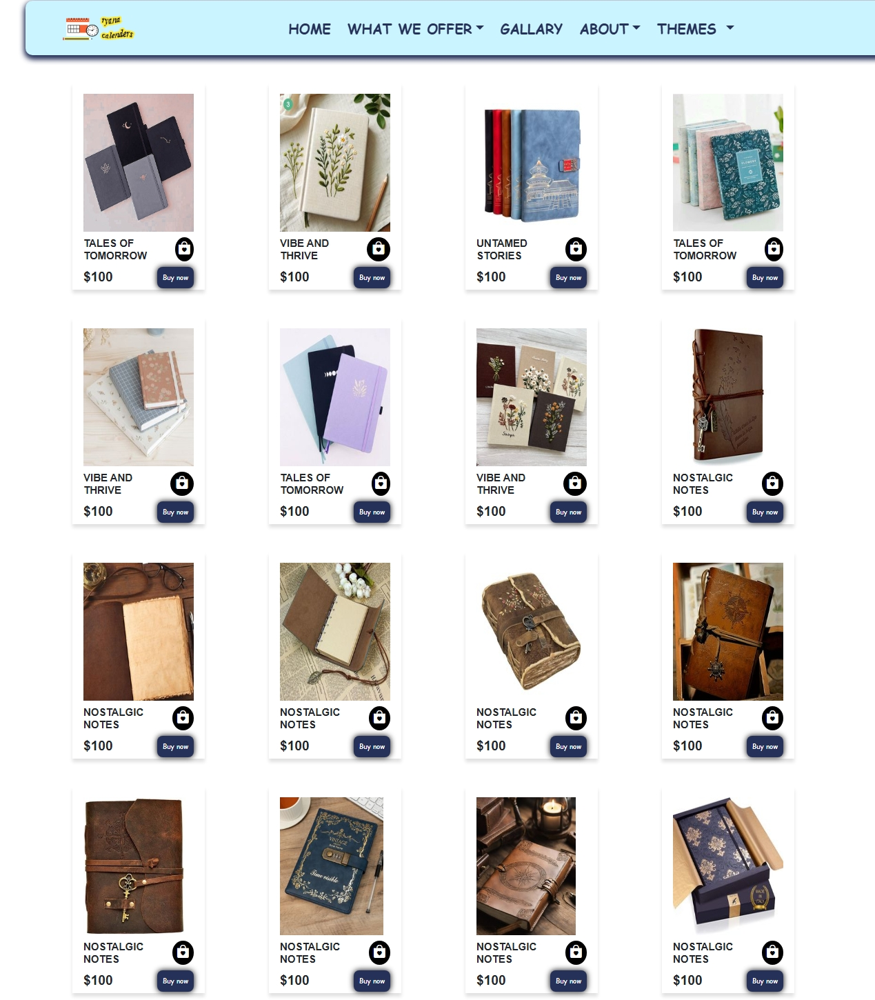
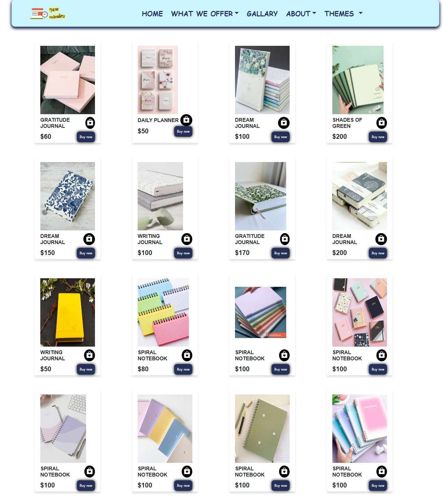
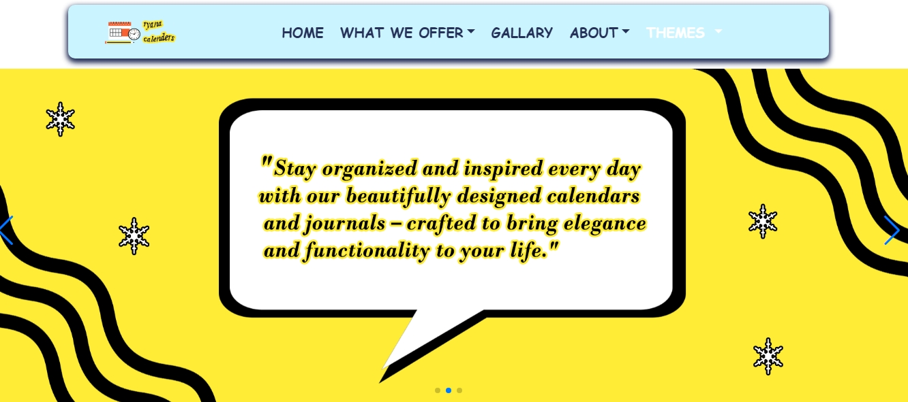
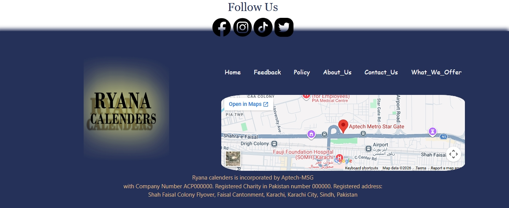
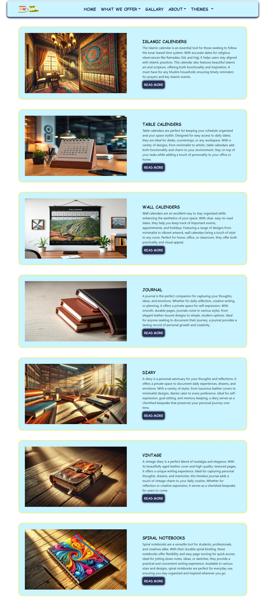
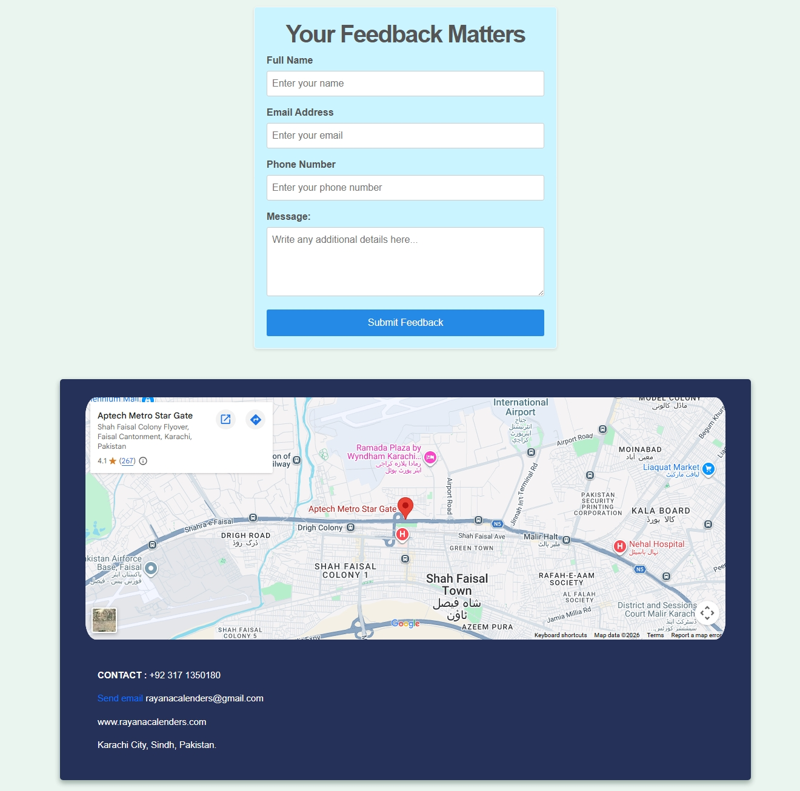

# 📅 Frontend Calendar Project

A modern and visually appealing **Calendar-based Website** built using **HTML, CSS, JavaScript, and Bootstrap**. This project showcases a collection of beautifully designed calendars along with themed diary journals, providing both functionality and aesthetic experience.

---

## 🌟 Project Overview

This website is designed to present **multiple types of calendars** and **creative diary journals** in one place. It focuses on user-friendly navigation, responsive design, and visually rich layouts.

Users can explore:

* Different calendar styles
* Themed diary journals
* Clean and organized UI

---

## ✨ Features

✔ Multiple Calendar Designs
✔ Themed Diary & Journal Sections
✔ Responsive Layout (Mobile + Desktop Friendly)
✔ Clean and Modern UI
✔ Smooth Navigation
✔ Organized Content Display

---

## 🎨 Technologies Used

* HTML5
* CSS3
* JavaScript
* Bootstrap

---

## 📱 Responsive Design

The project is fully responsive and works smoothly across:

* Mobile devices 📱
* Tablets 📱
* Desktop screens 💻

---

## 📸 Screenshots

### 🏠 Home Page

### 📅 Dairy Page

### 📖 Journal Page

### 🏠 Navbar

### 🏠 Footer

### 🏠 Gallery

### 📅 Contact Us

### 📅 About Us

---

## 🚀 How to Run the Project

1. Download or clone the repository
2. Open the project folder
3. Run `home.html` in your browser

---

## 💡 Purpose of Project

This project is created to:

* Practice frontend development skills
* Work with Bootstrap for responsive design
* Build visually engaging UI layouts
* Showcase creativity through themes and design

---

## 📌 Future Improvements

* Add backend functionality
* User login system
* Save personal journal entries
* Dynamic calendar events

---

## 👩‍💻 Author

**Uswah Mariam**
Frontend Developer (Beginner)

---

## ⭐ Show Your Support

If you like this project, consider giving it a ⭐ on GitHub!
